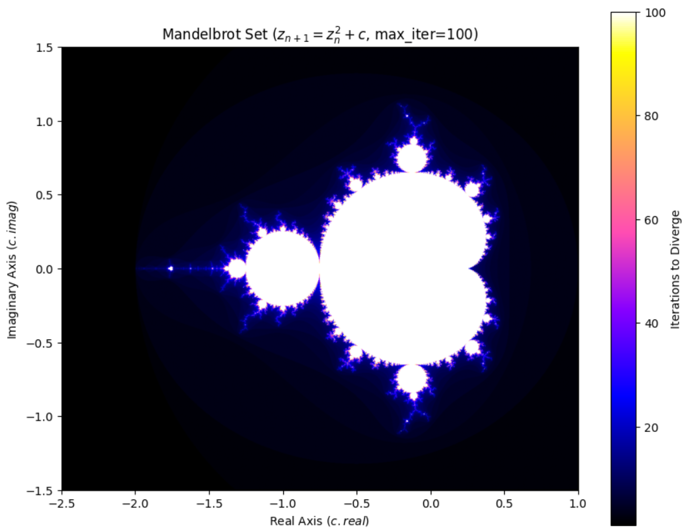
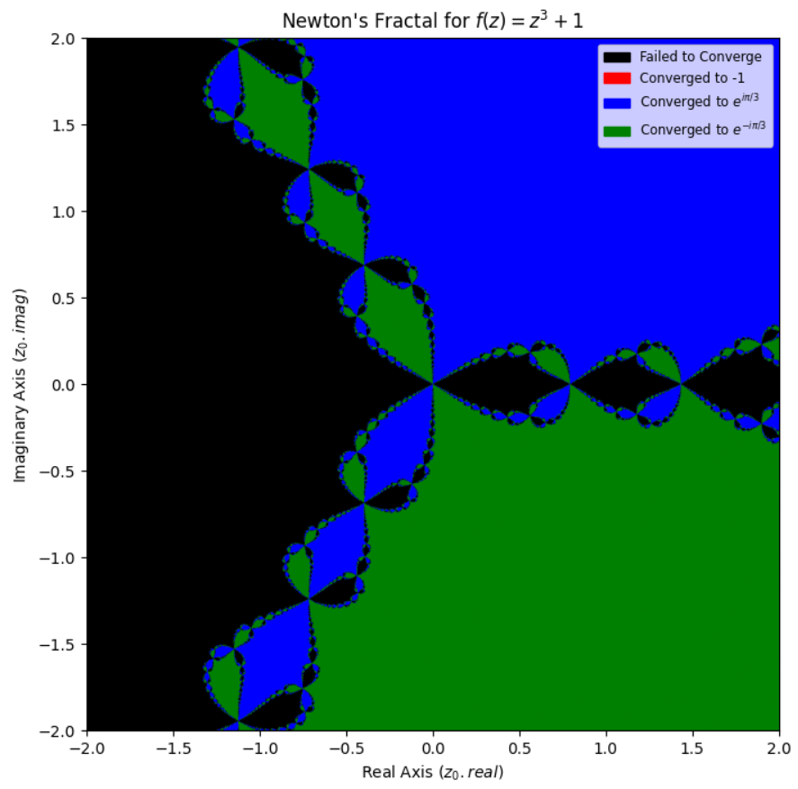
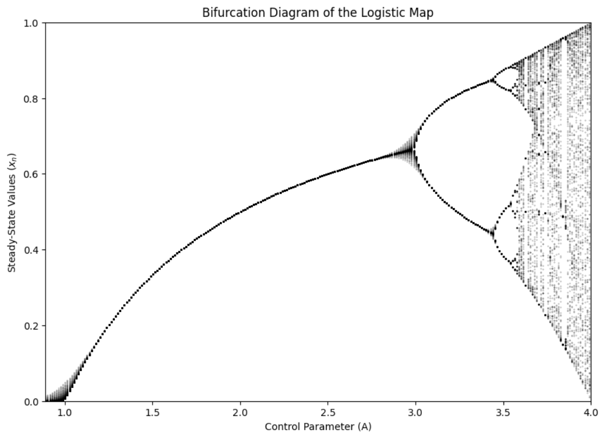
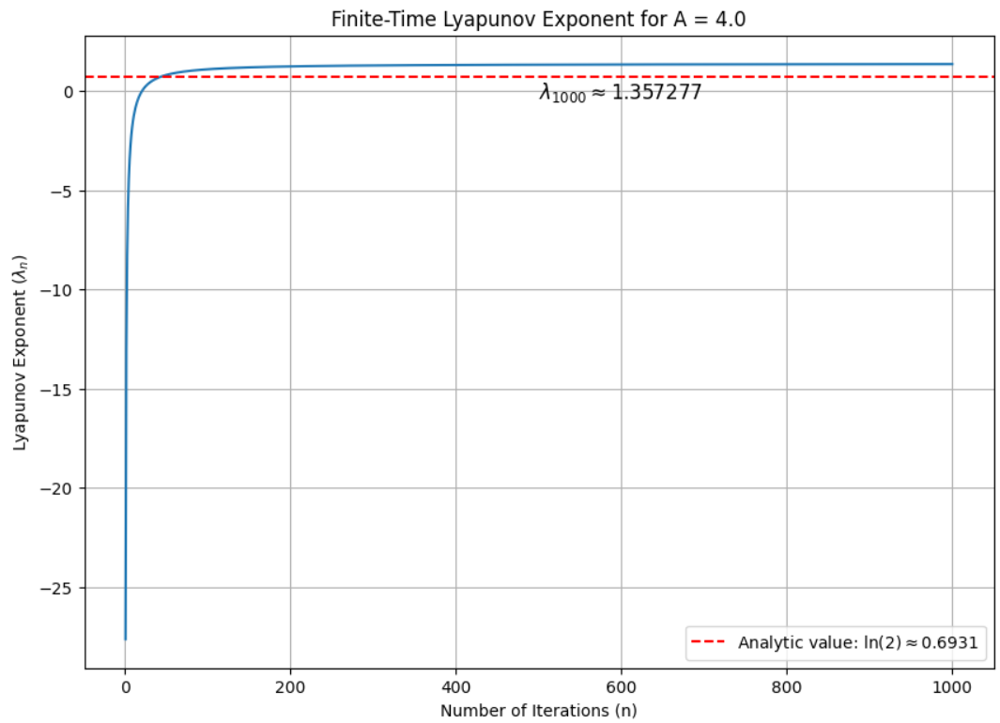
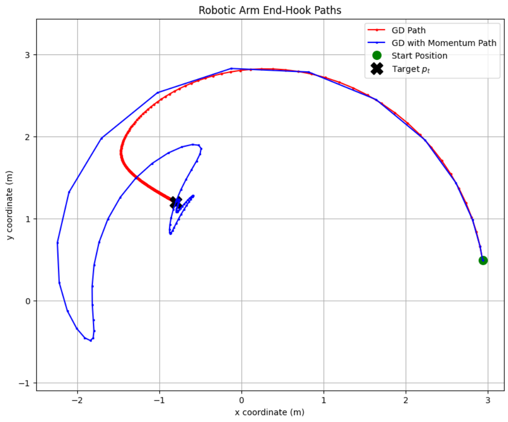
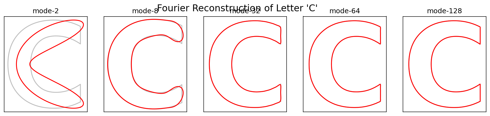
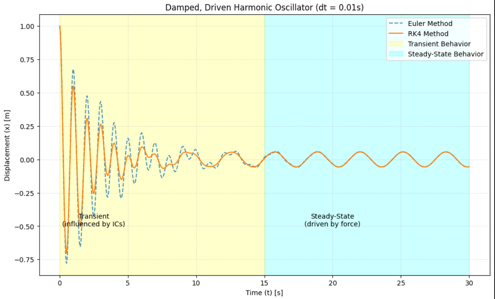
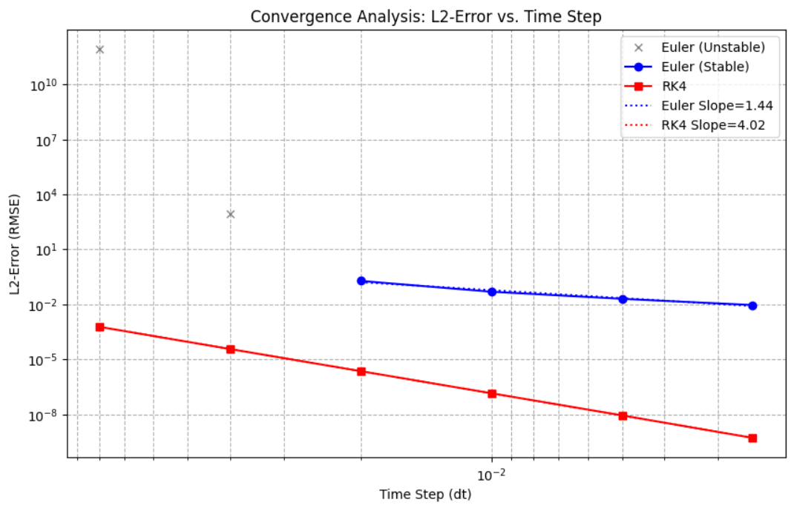

# Applied Numerical Optimization & Simulation Suite

A comprehensive computational mathematics portfolio developed in Python. This repository explores the algorithmic implementation of numerical methods to solve complex engineering and physical systems, ranging from non-linear kinematics to chaotic dynamical systems. 

The accompanying technical report detailing the mathematical derivations, proofs, and convergence analyses can be found in `Numerical_Methods_project_Report.pdf`.

##  Core Modules

### 1. Chaotic Dynamical Systems & Fractals

Simulates and visualizes discrete fractal typologies and chaotic behavior using iterative numerical methods.

* **Mandelbrot & Newton Fractals:** Utilizes complex fixed-point iteration and the Newton-Raphson scheme to map basins of attraction and fractal boundaries.
  
  
  

* **Logistic Map Bifurcation:** Simulates period-doubling routes to chaos and computes finite-time Lyapunov exponents to quantify deterministic chaos and sensitivity to initial conditions.

  
  

### 2. Kinematic Optimization (Gradient Descent)
Resolves an inverse kinematics problem for a 3-link robotic arm targeting specific spatial coordinates.

* **Numerical Gradients:** Computes gradients using central difference formulations for guaranteed $O(h^2)$ precision.
* **Momentum Acceleration:** Compares standard Gradient Descent against Gradient Descent with Momentum. The integration of momentum successfully damped high-frequency structural oscillations, reducing convergence time by over 86% (from 682 to 89 iterations).

  

### 3. Fourier Series 2D Boundary Reconstruction
Synthesizes complex 2D spatial boundaries using truncated complex Fourier series expansion.

* **Discrete Integration:** Evaluates spatial data vectors dynamically using the Composite Trapezoidal Rule.
* **Spectral Reconstruction:** Reconstructs coordinate outlines scaling up to 128 frequency modes, successfully demonstrating that low-frequency modes define macro-geometry while high-frequency modes map sharp edges.

  

* **Epicycle Simulation (M=128):** An animated reconstruction of the target data `C.csv` utilizing 128 rotating frequency vectors.

  

### 4. Damped Driven Harmonic Oscillator (ODE Solvers)
Numerically resolves second-order ordinary differential equations modeling physical kinematic systems.

* **Algorithmic Implementation:** Reduces the second-order model to an evaluable first-order system, solved via Euler's Method and the Fourth-Order Runge-Kutta (RK4) architecture.
* **Convergence Analysis:** Maps L2-Error Root Mean Square topography. Empirically validates that RK4 strictly maintains absolute stability and theoretical $O(h^4)$ convergence, vastly outperforming the conditionally stable Euler method.

  
  

* **Language:** Python 3.11
* **Scientific Computing:** NumPy, SciPy, scikit
* **Data Visualization:** Matplotlib
